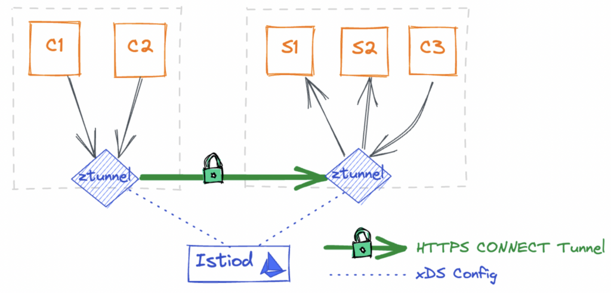
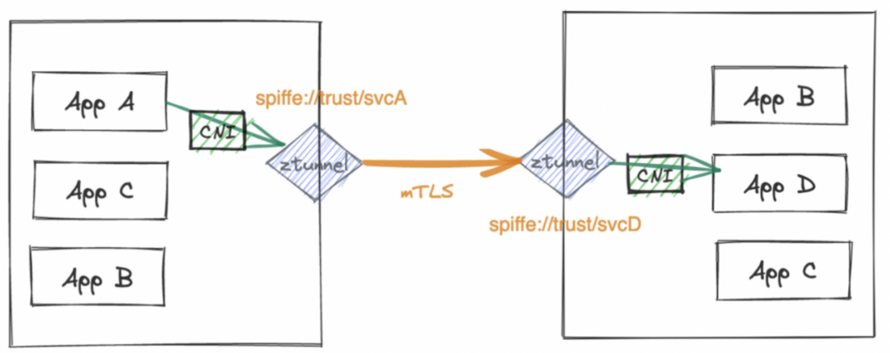
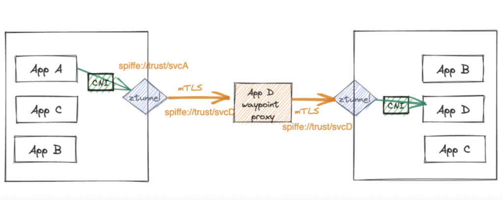
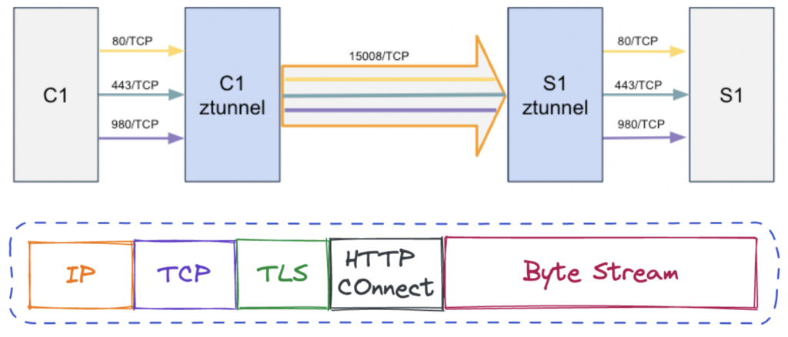

# Istio Ambient Mesh

## 架构

控制面组件

- istiod
- istio-cni (per node), only support ptp cni plugin, bridge cni plugin is in progress.
- ztunnel (per node)

通过给命名空间打上 label `istio.io/dataplane-mode=ambient`，让该命名空间下的所有应用被纳入到 ambient mesh 中。

```bash
kubectl label namespace { namespace-name } istio.io/dataplane-mode=ambient
```

## L4





## L7



waypoint ( per app )， waypoint 被攻破只会获取被代理的应用证书信息，而不会影响全部的服务。相较 cilium 的 daemon-set l7 envoy proxy，waypoint 风险更低。

给某个应用纳入 ambient mesh 里，以 bookinfo-productpage 为例：

```yaml
apiVersion: gateway.networking.k8s.io/v1alpha2
kind: Gateway
metadata:
 name: productpage
 namespace: default
 annotations:
   istio.io/service-account: bookinfo-productpage
spec:
 gatewayClassName: istio-mesh
```

该资源创建好之后，waypoint 会被创建出来以提供 L7 代理服务。

## geneveTunnel

node traffic -> ztunnel pod
geneveTunnel by **veth pair** device
link: https://github.com/istio/istio/blob/experimental-ambient/cni/pkg/ambient/net.go#L244

## TProxy - 透明代理

ztunnel inbound -> 15001 port

## HBONE



## References

1. https://youtu.be/nupRBh9Iypo
2. https://www.zhaohuabing.com/tags/ambient-mesh/
3. https://www.solo.io/blog/understanding-istio-ambient-ztunnel-and-secure-overlay/
