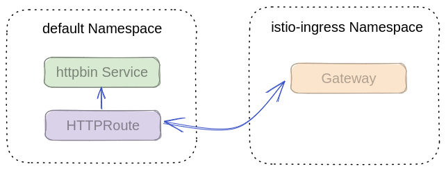

# A Brief Guide to Gateway API

## Introduction

Gateway API 是一个声明性配置 API，它提供了一种标准化方法来管理和公开 Kubernetes 集群中的服务。它旨在简化基于微服务的应用程序的网络流量路由和负载平衡的管理。

## API Overview


### 面向角色的分工设计

从应用的部署到可以被集群外部访问这一系列流程是比较长的，如果把这一整个作业交给一个角色，那这个角色得清楚应用的访问信息，网关的部署和配置，以及选择哪个 GatewayClass 提供者。很显然这个角色承担的太多。Gateway API 很聪明，将这一过程拆成多个角色来分工协作完成。

- 基础设施提供商提供 Gateway API 的实现，即 GatewayClass 的管理。
- 平台管理员负责网关的创建和分配，即 Gateway 资源的配置。
- 开发人员根据应用的配置路由，并做好网关关联。


### 功能边界

官方文档中的 [Gateway API 指南](https://gateway-api.sigs.k8s.io/guides/)介绍了 Gateway API 的一些使用场景。从文中我们可以得出一些 Gateway API 的功能边界，我将其总结如下几个点：

1. 网关的部署和监听端口的配置
2. 基于请求路径和请求 Header 的 路由匹配
3. HTTP 重定向和请求路径重写
4. 基于权重的流量分割，意味着可以做灰度，蓝绿，AB。
5. 跨命名空间路由
6. 网关支持 TLS 证书配置和 PassThrough 模式

### 资源模型

#### Gateway Class

GatewayClass 的设计目标是给不同的 API 提供商来实现这个标准，一个 GatewayClass 实例只能声明一个 provider。

#### Gateway

Gateway 用来管理网关的部署和命名空间可见性的权限分配。其中部署部分目前支持以下参数：网关的命名空间和名称；网关的监听端口。

#### Route

Route 的设计目标是给懂业务应用的那群开发者使用的。且以不同的协议来单独声明一个资源，以此来更加灵活的拓展 API。目前标准中支持的 Route 类型这些：

- HTTPRoute
- TLSRoute
- GRPCRoute
- TCPRoute
- UDPRoute

> 通常开发者只能给自己命名空间下的服务配置路由。如果给跨命名空间服务配置路由，则需要开发人员在目标服务命名空间创建 ReferenceGrant 资源来开放权限。更多内容参考[官方文档](https://gateway-api.sigs.k8s.io/api-types/referencegrant/)。

下面就 v1beta1 版本的 HTTPRoute 来介绍下。从 HTTPRoute 资源的定义上来看，它的配置可以抽象成三块内容：

1. ParentRefs: 声明该路由配置是关联到哪个网关上

2. Hostnames (optional): 定义一组用于匹配 HTTP 请求 Header 的 hostname 列表。

3. Rules: 定义一组 HTTP 路由规则。没个规则包含 matches, filters (optional), BackendRefs (optional) 这些属性。
   
   matches 是一组匹配规则
   filters 则是一组在 request 到 response 过程中的过滤器，从其定义描述中可以看到它支持 `(request | response)HeaderModifier` `requestMirror` `requestRedirect` `urlRewrite`。

要了解更多内容，请访问[官方文档](https://gateway-api.sigs.k8s.io/api-types/httproute/)。

## vs. Ingress

### Ingress supports

- HTTP host matching
- HTTP path matching
- TLS
- Routing to Service:Port
- For many different loadbalancer implementations

### Gatweay API adds

- HTTP header-based matching
- HTTP header manipulation
- Weighted traffic splitting
- Traffic mirroring
- Role-oriented resource model

### and has extensibility for

- Arbitary backend CRD references (buckets, functions, etc)
- Routing for other protocols (i.e. gRPC)

## Implementaion

作为“挟天子以令诸侯”(笔者调侃)的 Gateway API，不乏一些集成者。其中就包括 Istio，Cilium 等。[查看更多实现](https://gateway-api.sigs.k8s.io/implementations/).

### istio

站在流量治理的角度上看，Gateway API 和 Istio API 有很多相似的设计，比如 `Gateway` 和 `VirtualService` Gateway API 作为一个中立的 API 标准，从很多 Ingress 项目吸取了很多经验，其中就包括 Istio 的 API 设计。下面将介绍 Kubernetes Gateway API 和 Istio API 的不同点。

1. Istio `Gateway` 资源仅对已经部署的网关负载(Deployment/Service)配置；而在 Gateway API 中， `Gateway` 设计中还包括对网关进行**部署**。
2. Istio `VirtualService` 可以将不同协议的流量配置在同一个文件中；而在 Gateway API 中，不同的协议都有自己的资源，比如 `HTTPRoute` `GRPCRoute` `TCPRoute` 等。
3. 尽管 Gateway API 很多丰富的路由等流量治理功能，但至今仍未 100% 覆盖 istio 的特性。Istio 正在努力扩展 Gateway API 来更好的公开 istio 的功能。毕竟 Istio 未来是要将 Gateway API 作为其流量治理的[默认 API](https://istio.io/latest/blog/2022/gateway-api-beta/) 的。

#### API Support

从 istio 1.18 的 [Gateway API 文档](https://istio.io/latest/docs/tasks/traffic-management/ingress/gateway-api/#setup)来看，istio所支持的 Gatway API 仅 v1beta1 版本的 API：

- v1beta1.GatewayClass
- v1beta1.Gateway
- v1beta1.HTTPRoute
- v1beta1.ReferenceGrant

```bash
kubectl get crd gateways.gateway.networking.k8s.io &> /dev/null || \
  { kubectl kustomize "github.com/kubernetes-sigs/gateway-api/config/crd?ref=v0.6.2" | kubectl apply -f -; }
```

访问[这里](https://github.com/kubernetes-sigs/gateway-api/tree/main#status)来获取 Gateway API 的资源版本级别支持的情况。

#### 实践

下面我们在 default 命名空间下创建一个 httpbin 的服务，然后定义 Gateway 和 HTTPRoute 资源从网关公开 httpbin 服务的 API。该示例的资源概览如下图所示：



(Note): Istiod 会默认创建一个 `GatewayClass`，YAML 描述文件如下：

```yaml
apiVersion: gateway.networking.k8s.io/v1beta1
kind: GatewayClass
metadata:
  name: istio
spec:
  controllerName: istio.io/gateway-controller
  description: The default Istio GatewayClass
status:
  conditions:
  - lastTransitionTime: "2023-06-19T03:00:38Z"
    message: Handled by Istio controller
    observedGeneration: 1
    reason: Accepted
    status: "True"
    type: Accepted
```

step1): 部署一个测试应用服务 httpbin

```bash
curl -sSL https://raw.githubusercontent.com/istio/istio/release-1.18/samples/httpbin/httpbin.yaml | kubectl apply -f -
```

step2): 使用 Gateway API `Gateway` 创建一个网关，以及声明网关监听的端口信息

```bash
kubectl create namespace istio-ingress
kubectl apply -f - <<EOF
apiVersion: gateway.networking.k8s.io/v1beta1
kind: Gateway
metadata:
  name: gateway
  namespace: istio-ingress
spec:
  gatewayClassName: istio
  listeners:
  - name: default
    hostname: "*.example.com"
    port: 80
    protocol: HTTP
    allowedRoutes:
      namespaces:
        from: All
EOF
```

(verify): 检查自动创建的网关负载和 Service。

> 不想使用自动创建的网关，请参考[下文](#content/cloud-native/k8s-gateway-api#manual-deployment)来关联手动创建的网关。

```
❯ kubectl get svc -n istio-ingress
NAME            TYPE           CLUSTER-IP      EXTERNAL-IP   PORT(S)                        AGE
gateway-istio   LoadBalancer   10.101.210.20   <pending>     15021:32559/TCP,80:32052/TCP   45h

❯ kubectl get deploy -n istio-ingress
NAME            READY   UP-TO-DATE   AVAILABLE   AGE
gateway-istio   1/1     1            1           45h

❯ kubectl get pod -n istio-ingress
NAME                             READY   STATUS    RESTARTS      AGE
gateway-istio-5f557d485d-btgnp   1/1     Running   2 (30h ago)   45h
```

> Resources can be attached to a Gateway to customize it. However, most Kubernetes resources do not currently support attaching directly to a Gateway, but they can be attached to the corresponding generated Deployment and Service instead. This is easily done because both of these resources are generated with name `<gateway name>-<gateway class name>` and with a label `istio.io/gateway-name: <gateway name>`.

| Automated Resouces | NAME                                  | NAMESPACE   | Type         | LabelSelector                                       |
|:------------------:|:-------------------------------------:|:-----------:|:------------:|:---------------------------------------------------:|
| deployment         | `<gateway name>-<gateway class name>` | {namespace} |              | On **Pod**: istio.io/gateway-name: `<gateway name>` |
| service            | `<gateway name>-<gateway class name>` | {namespace} | LoadBalancer | istio.io/gateway-name: `<gateway name>`             |
| gateway (istio)    | -                                     | -           |              |                                                     |

step3): 给服务配置路由。

```bash
kubectl apply -f - <<EOF
apiVersion: gateway.networking.k8s.io/v1beta1
kind: HTTPRoute
metadata:
  name: http
  namespace: default
spec:
  parentRefs:
  - name: gateway
    namespace: istio-ingress
  hostnames: ["httpbin.example.com"]
  rules:
  - matches:
    - path:
        type: PathPrefix
        value: /get
    backendRefs:
    - name: httpbin
      port: 8000
EOF
```

(verify): 验证 Gateway API。

> 由于笔者的 Kubernetes 集群不支持 LoadBalancer，这里使用网关的 Service 地址来访问。

```bash
$ curl -s -I -HHost:httpbin.example.com "http://10.101.210.20/get"
HTTP/1.1 200 OK
server: istio-envoy
```

#### Troubleshooting

使用 [ksql](https://github.com/imuxin/ksql) 工具可以很方便的帮我们查看 istio 内部自动转化的 istio Gateway 和 VirtualService 资源。

```bash
$ ksql -e 'select * from istio_config'
+----------------+-----------------------------------+---------------+-------------------------------------------------------+
| KIND           | APIVERSION                        | NAMESPACE     | NAME                                                  |
+----------------+-----------------------------------+---------------+-------------------------------------------------------+
| HTTPRoute      | gateway.networking.k8s.io/v1beta1 | default       | http                                                  |
+----------------+-----------------------------------+---------------+-------------------------------------------------------+
| Gateway        | gateway.networking.k8s.io/v1beta1 | istio-ingress | gateway                                               |
+----------------+-----------------------------------+---------------+-------------------------------------------------------+
| Gateway        | networking.istio.io/v1alpha3      | istio-ingress | gateway-istio-autogenerated-k8s-gateway-default       |
+----------------+-----------------------------------+---------------+-------------------------------------------------------+
| VirtualService | networking.istio.io/v1alpha3      | default       | http-0-istio-autogenerated-k8s-gateway                |
+----------------+-----------------------------------+---------------+-------------------------------------------------------+
```

```json
// 使用 ksql 获取 istio Gateway 的    内容
// ksql -e 'select "{}" from istio_config where "{.metadata.name}" = gateway-istio-autogenerated-k8s-gateway-default '
{
    "apiVersion": "networking.istio.io/v1alpha3",
    "kind": "Gateway",
    "metadata": {
        "annotations": {
            "internal.istio.io/gateway-service": "gateway-istio.istio-ingress.svc.cluster.local",
            "internal.istio.io/parents": "Gateway/gateway/default.istio-ingress"
        },
        "creationTimestamp": "2023-06-27T08:50:35Z",
        "name": "gateway-istio-autogenerated-k8s-gateway-default",
        "namespace": "istio-ingress"
    },
    "spec": {
        "servers": [
            {
                "hosts": [
                    "*/*.example.com"
                ],
                "port": {
                    "name": "default",
                    "number": 80,
                    "protocol": "HTTP"
                }
            }
        ]
    }
}

// 使用 ksql 获取 istio VirtualService 的内容
// ksql -e 'select "{}" from istio_config where "{.metadata.name}" = http-0-istio-autogenerated-k8s-gateway '
{
    "apiVersion": "networking.istio.io/v1alpha3",
    "kind": "VirtualService",
    "metadata": {
        "annotations": {
            "internal.istio.io/parents": "HTTPRoute/http.default",
            "internal.istio.io/route-semantics": "gateway"
        },
        "creationTimestamp": "2023-06-29T06:25:42Z",
        "name": "http-0-istio-autogenerated-k8s-gateway",
        "namespace": "default"
    },
    "spec": {
        "gateways": [
            "istio-ingress/gateway-istio-autogenerated-k8s-gateway-default"
        ],
        "hosts": [
            "httpbin.example.com"
        ],
        "http": [
            {
                "match": [
                    {
                        "uri": {
                            "prefix": "/get"
                        }
                    }
                ],
                "name": "default.http.0",
                "route": [
                    {
                        "destination": {
                            "host": "httpbin.default.svc.cluster.local",
                            "port": {
                                "number": 8000
                            }
                        }
                    }
                ]
            }
        ]
    }
}
```

#### Manual Deployment

从上文中我们知道 Gateway API 是自动部署网关负载的。自动部署的网关我们目前没有办法控制更多具体的配置，比如像 CPU，内存的配置等。那么我们有办法将 `Gateway` 关联到手动部署的网关吗？答案是肯定的。Istio 已经给出了它的[方案](https://istio.io/latest/docs/tasks/traffic-management/ingress/gateway-api/#manual-deployment): 显示地声明 Gateway 的 addresses 属性为网关 Service 的 Hostname。下面给出一个示例 Gateway 来关联上文中的网关负载。

```diff
apiVersion: gateway.networking.k8s.io/v1beta1
kind: Gateway
metadata:
  name: gateway-clone
  namespace: istio-ingress
spec:
  gatewayClassName: istio
+ addresses:
+ - value: gateway-istio.istio-ingress.svc.cluster.local
+   type: Hostname
  listeners:
  - name: default
    hostname: "*.example.com"
    port: 80
    protocol: HTTP
    allowedRoutes:
      namespaces:
        from: All
```

#### Mesh Traffic

> Configuring internal mesh traffic using the Gateway API is an `experimental` feature currently under development and pending upstream agreement.

The Gateway API can also be used to configure mesh traffic. This is done by configuring the parentRef to point to a service, instead of a gateway.

For example, to add a header on all calls to an in-cluster Service named example:

```yaml
apiVersion: gateway.networking.k8s.io/v1beta1
kind: HTTPRoute
metadata:
  name: mesh
spec:
  parentRefs:
  - kind: Service
    name: example
  rules:
  - filters:
    - type: RequestHeaderModifier
      requestHeaderModifier:
        add:
        - name: my-added-header
          value: added-value
  - backendRefs:
    - name: example
      port: 80
```

## References

1. https://istio.io/latest/docs/tasks/traffic-management/ingress/gateway-api/